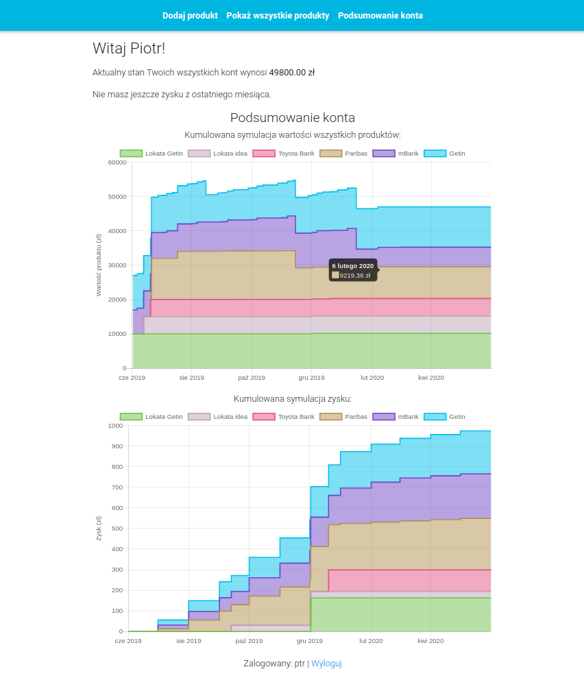
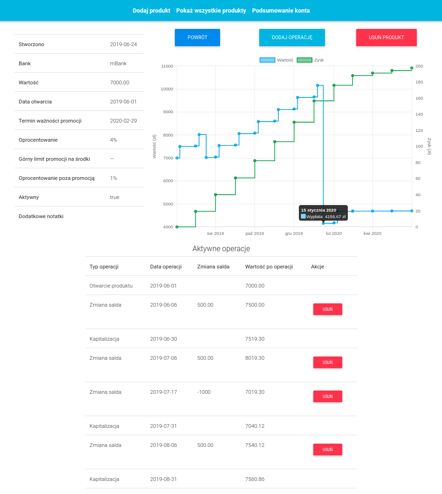

# Private Investment Manager
A management tool for tracking one's promotional bank products with simulation and visualization capabilities.
## Introduction  
The banks often offer short term investments or savings accounts under very attractive conditions to attract customers. However, the attractive gain rate usually applies only to limited value and is relatively short. This leads to situation where one has multiple promotional financial products, each with different value and various expiration dates. This can easily bring chaos into investors wallet.

The intention of developing the Private investment manager was to help with the organizaton and track keeping of user investments and promotional savings accounts. The need for this application arose from real demand and it was developed as my first real application as the final project during my Java Bootcamp which I graduated on June '19.  
## Technologies
The application was developed in MVC pattern using the following technologies: 

-- Core backend:
- Java 8  
- Spring Framework    
  - Spring Boot    
  - Spring Security  
  - Spring Data    
- Hibernate    
- JUnit + Mockito   
- MySQL    

-- View layer:
- Thymeleaf  
- Bootstrap    
- Javascript + jQuery    
- chart.js    
- moment.js  
## Scope of functionalities  
- Financial simulation of savings accounts for the next year including monthly capitalization. Simulation includes both value and net profit, which are visualized on the interactive chart.   
- Custom payments and withdraws (also periodic) to savings account. All balance changes are properly included in the capitalization calculations.  
- Capitalization calculations include two different interest rates - promotional and regular, depending on the circumstances.  
- Summary page where stacked interactive charts presents net profit and value simulations for all products in one's wallet.   
- Displaying current total value of all product calculated dynamically from all products.   
- Complete registration and login process based on Spring Security.  
- Although the application is fully in Polish (customer demand), it is fully internationalized and no single hardcoded text is present. Due that, it be easily translated to any other language.  
## Examples of use  
Summary page:  
  
Savings account details page:  

