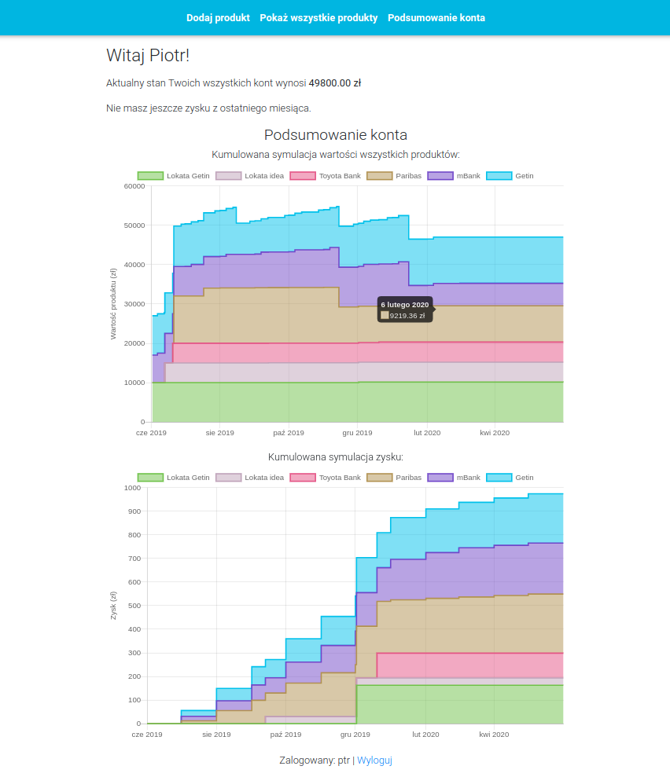
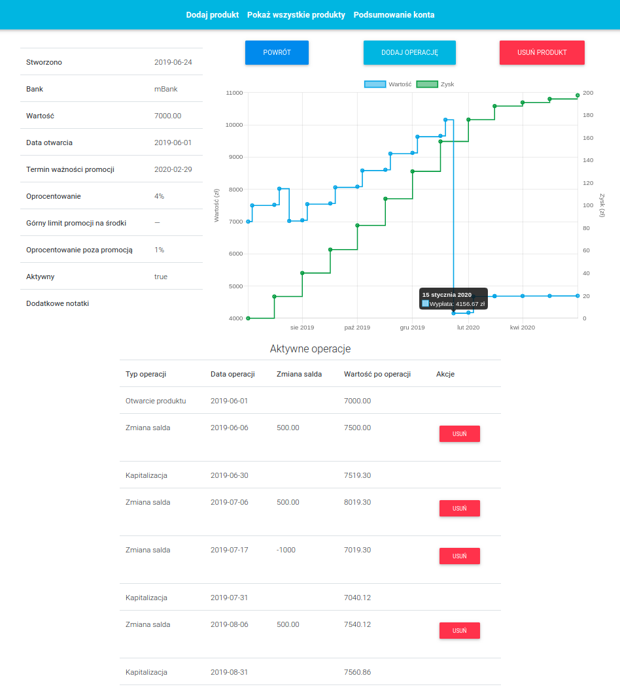

# Private Investment Manager
A management tool for tracking one's promotional bank products with simulation and visualization capabilities.
## Introduction
The banks often offer short term investments or savings accounts under very attractive conditions to attract customers. However, the attractive gain rate usually applies only to limited value. This leads to situation where one has multiple promotional financial products, each with different value and various expiration dates. This can easily bring investment chaos.
#### But not anymore!
Private investment manager will help you in organizing and keeping track of all your investments and promotional savings accounts. The need for this application arise from real demand and it was developed as a final project during my Java Bootcamp which I graduated on June '19.
## Technologies used  
The application was developed in MVC pattern using the following technologies:   
- Java 8
- Spring Framework  
  - Spring Boot  
  - Spring Security
  - Spring Data  
- Hibernate  
- JUnit + Mockito 
- MySQL  
- Thymeleaf
- Bootstrap  
- Javascript + jQuery  
- chart.js  
- moment.js
- i18n internationalization
## Scope of functionalities
- Financial simulation of savings accounts for the next year including monthly capitalization. Simulation includes both value and net profit, which are visualized on the interactive chart. 
- Custom payments and withdraws (also periodic) to savings account. All balance changes are properly included in the capitalization calculations.
- Capitalization calculations include two different interest rates - promotional and regular, depending on the circumstances.
- Summary page where stacked interactive charts presents net profit and value simulations for all products in one's wallet. 
- Displaying current total value of all product calculated dynamically from all products. 
- Complete registration and login process based on Spring Security.
- Although the application is fully in Polish (customer demand), it is fully internationalized and no single hardcoded text is present. Due that, it be easily translated to any other language.
## Examples of use
Summary page:

Savings account details page:

## Project status
The application will be deployed in near future in a presented simulator form. However, the core functionality demanded by the customer, the tracker, is still to be implemented. 
## Features to be implemented
#### The tracker
- The tracker will make daily update for each product value and store it in the database, instead of dynamical calculations each time on demand. 
- A the end of month, the tracker will confirm capitalization of all savings accounts and no more changes to the past month financial operations can be made.
- Each product will be marked as non active when the time reaches its validity date and it won't be taken into account anymore for summarizing statistics.
#### Email notifications
- A toggleable reminders delivered to user email before the end of validity date for his products.
